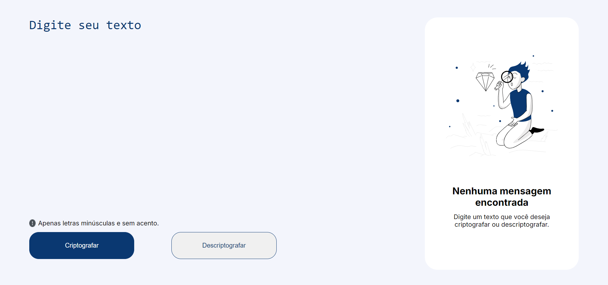
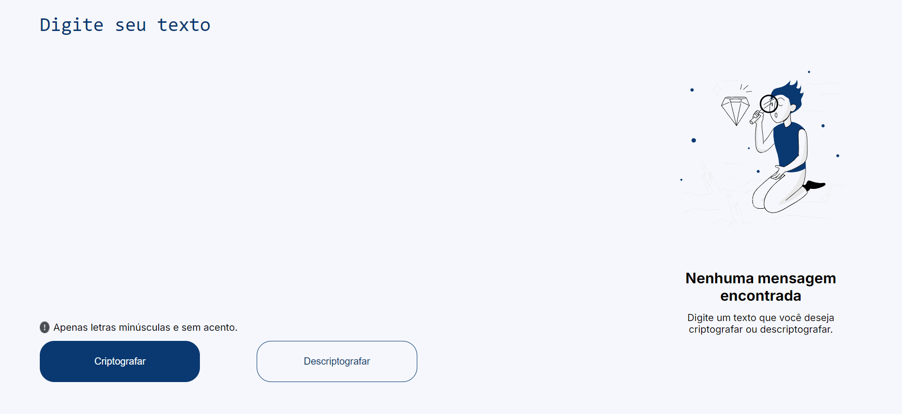

# Decodificador de Texto

## Descrição do projeto
Este projeto consiste em um decodificador de texto capaz de converter mensagens codificadas em texto legível. Também pode codificar textos, permitindo ao usuário tanto codificar quanto decodificar mensagens.

## Funcionalidades

- `Funcionalidade 1:` Criptografar mensagens de texto com até 100 caracteres.

- `Funcionalidade 2:` Descriptografa mensagens que foram criptografadas usando a mesma aplicação, restaurando o texto original.

## Aplicação

## ✔️ Tecnologias e técnicas utilizadas
- ``Html5``
- ``CSS3``
- ``Javascript``
- ``Flexbox``

## Como executar o projeto

Após baixar o projeto, você pode abrir com ``seu navegador padrão``. Para isso:
- Navegue até o local onde fez o download do projeto usando o explorador de arquivos do sistema.
- (Caso o projeto seja baixado via zip, é necessário extraí-lo);
- Clique duas vezes no arquivo HTML para abri-lo no navegador padrão.

## 📁 Acesso ao projeto
Você pode acessar os arquivos do projeto clicando [aqui](https://github.com/gabriellrocha/decodificador) ou [baixa-lo](https://github.com/gabriellrocha/decodificador/archive/refs/heads/main.zip).
